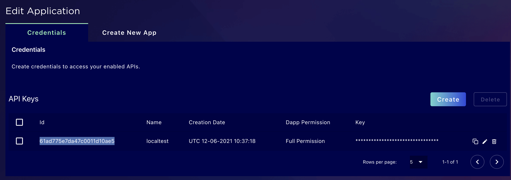

# Polis SDK Example

# Create a polis account

Open https://polis-test.metis.io/#/login and use your email address to create a polis account.

NOTE: check out `https://polis.meits.io` if you want to use polis production enviroment.

# Create a polis application

Open https://polis-test.metis.io/#/application

Add `127.0.0.1:8000` to `Authorized Domains` option.


You will get the app id and app secret key.



# Install nodejs

Nodejs 16

# Install dependencies

npm install

# Add your env file

create a `.env.test` file

```
NODE_ENV = "test"
VUE_APP_API_HOST = "https://polis-test.metis.io"
VUE_APP_APP_ID = "YOUR POLIS APP ID"
VUE_APP_APP_SECRET = "YOUR POLIS APP SECRET"
VUE_APP_TOKEN_URL = "https://polis-test.metis.io"
VUE_APP_RETURN_URL ="http://127.0.0.1:8000/#/about?test=1"
VUE_APP_RETURN_URL2 ="http://127.0.0.1:8000/#/polis-client-test?test=2"
```
